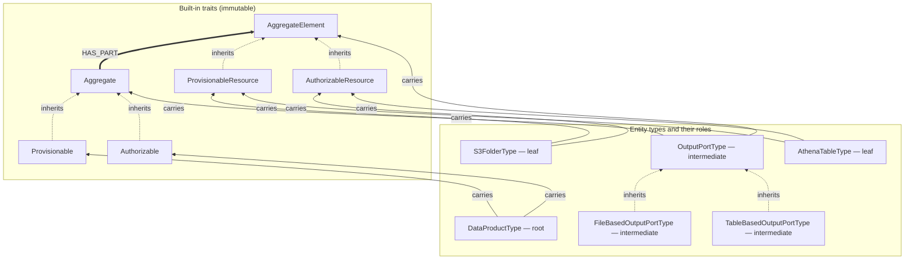
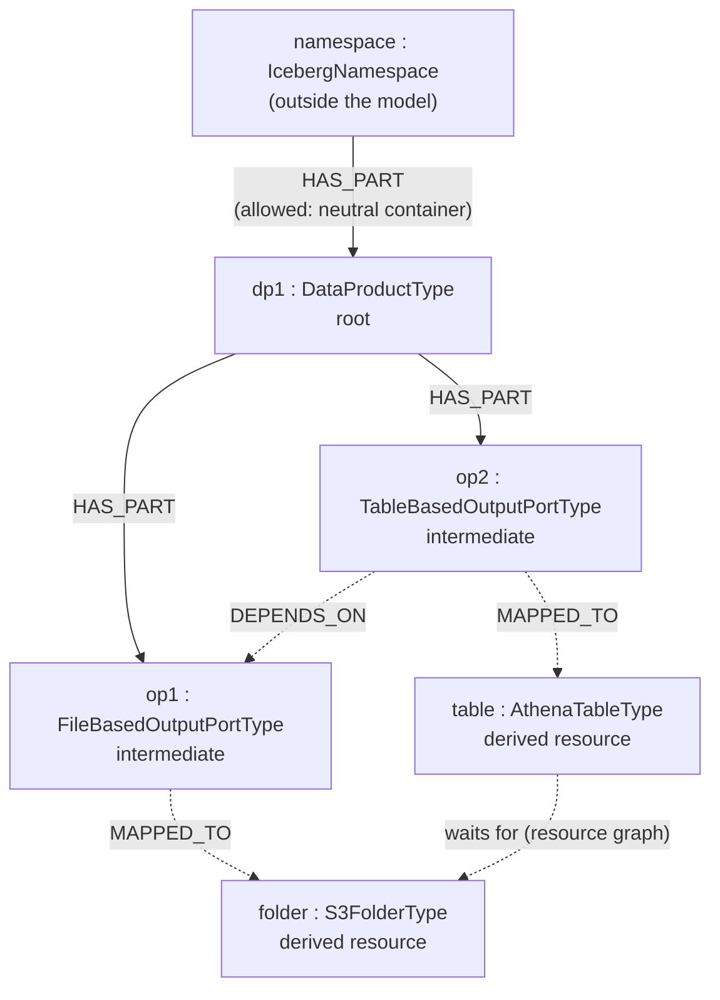
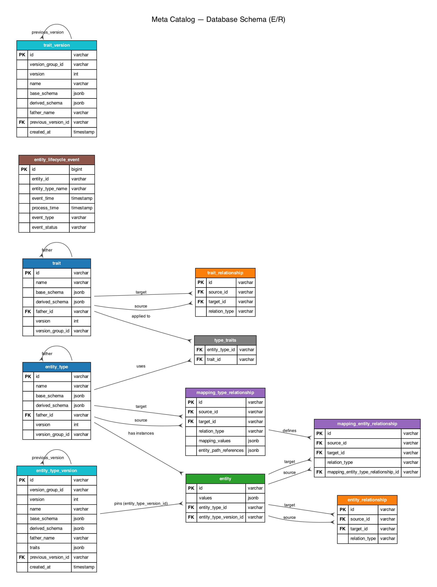

# Meta Catalog

<!--
  Two flavours of this file, and the badges are the only thing that differs. GitHub renders
  .github/README.md in preference to this one; GitLab renders only this one. That is what lets the
  same coverage badge open the report the host you are reading on published — GitHub Pages from
  `coverage-pages`, the project wiki from `coverage-wiki` — instead of sending half the readers
  across to the other remote's infrastructure.

  Everything between the markers below is generated. Edit scripts/readme-sync.sh, run it, and it
  rewrites both files; `--check` in the verify stage of both pipelines fails if either is stale.
  The coverage and test figures are the ones stated under Coverage, refreshed when those move.
-->
<!-- BADGES:START -->
[](https://gitlab.davidgreco.it/dgreco/metacatalog/-/pipelines)
[](https://gitlab.davidgreco.it/dgreco/metacatalog/-/wikis/Coverage)
[](#coverage)
[](LICENSE)
[](#technology-stack)
[](#technology-stack)
[](#prerequisites)
<!-- BADGES:END -->

A comprehensive metadata management system built with Spring Boot for managing entities, entity types, traits, and their relationships with integrated ontology support.

## Features

- **Entity Management**: CRUD operations for business entities with JSON-based attributes
- **Entity Types**: Define and manage entity type hierarchies
- **Traits**: Reusable characteristics applicable to entities
- **Type Versioning**: Immutable version history for entity types and traits — every update creates a new version, old versions stay readable and deletable, and the version chain is shown on the graph
- **Relationship Management**: Complex relationship mapping between entities
- **Mappings**: Rule-based transformation of source entities into target entity types, evaluated automatically on source create/update (see [Mappings](#mappings))
- **JSON Schema Validation**: Validate entity attributes against schemas
- **Graph Operations**: Advanced relationship traversal using JGraphT
- **Ontology Integration**: Semantic web support via an embedded Ontop 5.5.0 virtual knowledge graph, exposed as a SPARQL 1.1 Protocol endpoint and a Yasgui query UI
- **Aggregates**: Compose entities into trees of parts, authored as a single document against one generated schema that combines every entity type involved, and deleted as a whole (see [Aggregates](#aggregates))
- **Provisioning**: Run a registered task for every `ProvisionableResource` of an aggregate in dependency order, and tear it down in reverse (see [Aggregates](#aggregates))
- **Authorization**: The same machinery over a second, independent pair of traits — every `AuthorizableResource` of an `Authorizable` aggregate is granted access in dependency order and has it withdrawn in reverse, recorded separately from provisioning so an aggregate can be provisioned and not yet authorized (see [Aggregates](#aggregates))
- **Referential Safety**: Deletions that would strand an entity, dangle a link or break a mapping's path resolution are refused, with an exact per-link check rather than a type-level one (see [Deleting entities and links](#deleting-entities-and-links))
- **Immutable Model**: Traits, entity types and trait relationships a module depends on can be frozen against deletion and versioning, declared from a Java module applied idempotently at startup (see [Immutable model](#immutable-model))
- **Bulk Operations**: Efficient bulk loading and updates
- **Audit Trail**: Entity lifecycle event tracking
- **REST API**: Comprehensive OpenAPI-documented REST endpoints
- **Iceberg REST Catalog**: an independent application implementing the standard Apache Iceberg REST catalog API over the metacatalog — Spark / Trino / PyIceberg can use it as their table catalog, and every namespace, table and schema version becomes a first-class, linkable catalog entity (see [Iceberg REST Catalog](#iceberg-rest-catalog))
- **Hive Metastore**: an independent application implementing the Apache Hive Metastore Thrift protocol over the metacatalog — Hive / Spark / Trino can use it as their metastore, and every database, table and partition becomes a first-class, linkable catalog entity (see [Hive Metastore](#hive-metastore))
- **Pluggable Authentication**: `none` / HTTP Basic / OAuth2 (JWT) / LDAP, selectable via config (see [Security](#security))
- **Web UI**: Server-side rendered pages for creating traits, entity types, mappings, links, instances and aggregates, with interactive JSON Schema and schema-driven value builders, a catalog graph, instance search by type and JSONPath, and provision / unprovision / authorize / reject actions with a site-wide progress popup

## Technology Stack

- **Java 25**
- **Spring Boot 4.1.0**
- **PostgreSQL** (JDBC driver 42.7.13, server 18+)
- **Maven 3.9.9+**
- **Ontop 5.5.0** (embedded SPARQL endpoint) · **RDF4J 5.3.0** (SPARQL protocol + result serialisation)

## Prerequisites

- Java 25
- Maven 3.9.9 or higher
- PostgreSQL 18+
- Docker (for testing with Testcontainers)

## Quick Start

### Option 1: Docker Compose (Recommended)

Run the whole stack locally with a single command — the application is built from
source inside Docker (via the root `Dockerfile`), so no local Maven build or
pre-published image is required:

```bash
# Clone the repository
git clone https://github.com/dgreco/metacatalog.git
cd metacatalog

# Build the application image from source and start everything
docker compose up --build
```

This starts:
- **PostgreSQL 18.4** on port 5432
- **Meta Catalog Application** on port 8080 (built from source, waits for the database to be healthy)
- **Bulk loader** (one-shot, `curlimages/curl`) — seeds the database with sample
  traits, entity types and entities from `docker/bulk/` once the app is healthy

Nothing is provisioned by starting the stack. Provisioning is something you ask for, and it runs
the task registered for every `ProvisionableResource` in dependency order; unprovisioning tears
them down in the reverse order, so nothing is removed while another resource still depends on it.
The demo registers a task that reports what it would do instead of creating anything:

```bash
# the aggregate root seeded by the loader
ROOT=$(curl -s -u admin:admin \
  'http://localhost:8080/metacatalog/v1/entity?entityTypeName=DataProductType' \
  | grep -o '"id":"[^"]*"' | head -1 | sed 's/.*:"//; s/"//')

curl -X POST -u admin:admin http://localhost:8080/metacatalog/v1/aggregate/$ROOT/provision
curl -X POST -u admin:admin http://localhost:8080/metacatalog/v1/aggregate/$ROOT/unprovision

docker logs metacatalog-app | grep -E '\[(un)?provisioning\]'
# [provisioning]   start S3FolderType id=0849185c… {"path":"/root/dp1/op1","bucket":"my-bucket"}
# [provisioning]   done  S3FolderType id=0849185c…
# [provisioning]   start AthenaTableType id=693457a7… {"table":"op2",…}
# [provisioning]   done  AthenaTableType id=693457a7…
# [unprovisioning] start AthenaTableType id=693457a7…      <- reversed
# [unprovisioning] done  AthenaTableType id=693457a7…
# [unprovisioning] start S3FolderType id=0849185c…
# [unprovisioning] done  S3FolderType id=0849185c…
```

Provisioning a freshly seeded aggregate needs its resources to exist first — they are derived
asynchronously by the mapping updater a second or so after the instances load. Provisioning before
then does not fail, it just finds nothing to do.

Both calls are synchronous by default: a 204 means every resource in the aggregate is done. Each
one ends up `PROVISIONED` or `UNPROVISIONED`, or `FAILED` with the error in `provisioningResult`.
Add `?async=true` to get a 202 with a schedule id instead, and poll
`GET /metacatalog/v1/procedure/{scheduleId}` for `RUNNING` / `SUCCEEDED` / `FAILED` — useful when
a provisioning task is slow enough that holding the HTTP request open is not an option.

The same aggregate is also `Authorizable`, which is a **second lifecycle, not a second name for
the first**. What it grants is declared on the aggregate root — the subjects it recognises, the
permissions it can grant, and the grants binding the two — and a run resolves that policy per
resource:

```bash
curl -X POST -u admin:admin http://localhost:8080/metacatalog/v1/aggregate/$ROOT/authorize
curl -X POST -u admin:admin http://localhost:8080/metacatalog/v1/aggregate/$ROOT/reject

docker logs metacatalog-app | grep -E '\[(authorizing|rejecting)\]'
# [authorizing] start  S3FolderType id=0849185c… {"path":"/root/dp1/op1","bucket":"my-bucket"}
# [authorizing] grants S3FolderType id=0849185c… analysts(GROUP)=READ, dp1-loader(SERVICE)=READ|WRITE
# [authorizing] done   S3FolderType id=0849185c…
# [authorizing] start  AthenaTableType id=693457a7…
# [authorizing] grants AthenaTableType id=693457a7… analysts(GROUP)=READ
# [authorizing] done   AthenaTableType id=693457a7…
# [rejecting]   start  AthenaTableType id=693457a7…        <- reversed, as unprovisioning is
# [rejecting]   done   AthenaTableType id=693457a7…
# [rejecting]   start  S3FolderType id=0849185c…
# [rejecting]   done   S3FolderType id=0849185c…
```

The two resources hold different things because the demo's second grant is narrowed to
`S3FolderType`. Access is granted after — and withdrawn before — access to whatever a resource is
derived from, the same asymmetry provisioning has and for the same reason. The outcome lands in
`authorizationStatus` / `authorizationResult` (`AUTHORIZED` / `REJECTED` / `FAILED`), a different
pair of fields from the provisioning one: the two questions have different answers and neither
overwrites the other. Each resource additionally records `effectiveGrants`, the grants that run
applied there, so "which resources may `analysts` read?" is a query rather than a guess:

```bash
curl -s -u admin:admin http://localhost:8080/metacatalog/v1/aggregate/$ROOT/access | jq
```

returns the declared policy and, per resource, the grants in force. `?async=true` and the schedule
poll work identically. `GET /metacatalog/v1/aggregate/authorizable-type` lists the types that offer
the capability, as `.../provisionable-type` does for provisioning.

Once up, the app is available at:
- **Web UI**: http://localhost:8080/ui
- **Swagger UI**: http://localhost:8080/swagger-ui.html
- **SPARQL UI**: http://localhost:8080/sparql

> The first build downloads the Maven dependencies inside the image (a few minutes);
> later builds reuse the cached dependency layer unless a `pom.xml` changes. The image
> build skips tests (they require a Docker daemon for Testcontainers) — run `mvn verify`
> on the host for the full test suite.

**Always pass `--build` to run the latest code.** Plain `docker compose up` reuses the
existing `metacatalog:0.0.1-SNAPSHOT` image and can therefore run a stale application.
The build context includes `.git`, so any commit invalidates the image layer and forces
a rebuild; `--build` also rebuilds whenever any source file changes. A `Makefile` wraps
the common flows so this is hard to get wrong:

```bash
make run        # docker compose up --build            (foreground, latest code)
make up-d       # docker compose up --build -d          (detached)
make rebuild    # docker compose build --no-cache app   (force a full rebuild) + up -d
make logs       # follow the application logs
make down       # stop (make down ARGS=-v to drop the DB volume)

make run-keycloak     # the stack with Keycloak / oauth2 auth incl. browser SSO (foreground)
make up-keycloak-d    # same, detached
make down-keycloak    # stop the Keycloak stack (ARGS=-v drops the DB volume)
```

To run detached, or to stop, without the Makefile:
```bash
docker compose up --build -d   # start in the background
docker compose down            # stop (keep data)
docker compose down -v         # stop and remove data volumes
```

#### Verifying which version is running

The application stamps the build with its version, git commit and build time. After
startup it logs a line such as:

```
Meta Catalog 0.0.1-SNAPSHOT started (git a1b2c3d, built 2026-07-16T10:51:00Z)
```

and the same information is served by the info actuator endpoint:

```bash
curl http://localhost:8080/actuator/info   # or: make info
# { "git": { "commit": { "id": { "abbrev": "a1b2c3d" }, ... }, "branch": "..." },
#   "build": { "version": "0.0.1-SNAPSHOT", "time": "..." }, ... }
```

Compare `git.commit.id.abbrev` with `git rev-parse --short HEAD` (and check `git.dirty`)
to confirm the container is running exactly the code you expect.

### Option 2: Local Development

#### 1. Clone the Repository

```bash
git clone https://github.com/dgreco/metacatalog.git
cd metacatalog
```

#### 2. Setup Database

```bash
# Create PostgreSQL database
createdb metacatalog

# Create user
psql -c "CREATE USER metacatalog WITH PASSWORD 'metacatalog';"
psql -c "GRANT ALL PRIVILEGES ON DATABASE metacatalog TO metacatalog;"
```

#### 3. Build the Project

```bash
mvn clean install
```

#### 4. Run the Application

```bash
mvn spring-boot:run -pl metacatalog-application
```

The application will start on port 8080.

## Project Structure

```
metacatalog/
├── metacatalog-core/           # Core domain, repositories, services, and the startup
│                               #   extension point for declaring an immutable model
├── metacatalog-functions/      # Procedures that run over entities (e.g. provisioning)
├── metacatalog-functions-provisioning-tasks/  # Concrete provisioning tasks + registrars
├── metacatalog-openapi/        # OpenAPI spec and generated controllers / client
├── metacatalog-ui/             # Server-side rendered UI (Thymeleaf) for the whole catalog
├── metacatalog-security/       # Pluggable authentication (none / basic / oauth2 / ldap)
├── metacatalog-sparql/         # Embedded Ontop SPARQL 1.1 endpoint + Yasgui query UI
├── metacatalog-application/    # Spring Boot application (aggregates all modules)
├── metacatalog-iceberg-catalog/  # Independent app: Apache Iceberg REST catalog over the
                                #   metacatalog (own port/image; + pyiceberg-test, a
                                #   uv-managed Python smoke-test project)
└── metacatalog-hive-metastore/  # Independent app: Apache Hive Metastore Thrift server
                                #   over the metacatalog (own port/image; + hive-test, a
                                #   Maven smoke-test project outside the reactor)
```

The UI module is a library that is served by `metacatalog-application` on the same
port (8080). Its controllers go through the REST API exclusively, so the UI exercises the
same contract external clients do — `metacatalog-core` is kept off the module's compile
classpath (declared nowhere, and excluded from `metacatalog-openapi`), which makes that
boundary a compile error rather than a convention. The trait / entity-type forms
include a client-side JSON Schema builder that assembles the schema document, while the
instance and aggregate forms work in the other direction — reading a schema and generating
typed inputs from it.

## Development

### Code Formatting

This project uses Google Java Format via Spotless. Always format your code before committing:

```bash
mvn spotless:apply
```

Check formatting:

```bash
mvn spotless:check
```

### Running Tests

```bash
# Unit tests
mvn test

# All tests including integration tests
mvn verify
```

Test totals by module (verified on this checkout; every `@SpringBootTest` needs a Docker daemon
for the Testcontainers PostgreSQL): core 171 · ui 69 · security 23 · hive-metastore 22 · openapi 20 · iceberg-catalog 14 · functions 11 · sparql 8 · provisioning-tasks 5 · application 9 = **352, 0 failures**.

### Coverage

JaCoCo runs in the ordinary build: every module writes its report under `target/site/jacoco`, and
`./scripts/coverage.sh` prints the one-line total both pipelines publish. On this checkout:
**55.2% of instructions, 37.8% of branches, 57.5% of lines**.

The figure is a sum over the per-module reports rather than a JaCoCo aggregate, because the
Iceberg catalog and the Hive Metastore are independent applications nothing else depends on, so no
single module's `report-aggregate` could fold them in. A module's figure counts only its own
classes, wherever the test that ran them lives.

Each remote publishes the report its own pipeline computed, and the coverage badge at the top of
this page opens the one belonging to the host you are reading it on:

| Remote | Job | Where it shows |
|---|---|---|
| GitHub | `coverage-pages` | the browsable per-module reports on [GitHub Pages](https://dgreco.github.io/metacatalog/), and the total in the run summary |
| GitLab | `build` | the percentage on the MR widget and the project badge, from the `coverage:` keyword; the reports as downloadable artifacts |
| GitLab | `coverage-report` | **covered and uncovered lines painted onto the merge request diff**, from a Cobertura report that [`scripts/jacoco-to-cobertura.py`](scripts/jacoco-to-cobertura.py) converts out of the JaCoCo XML |
| GitLab | `coverage-wiki` | the report as a **wiki page** the badge links to, rendered in the browser: totals, per module, per package |
| GitLab | `pages` | the browsable HTML site on that instance's Pages, where it has them |

Without Pages, GitLab will not render an HTML artifact in the browser at all, so `coverage-wiki`
writes the report to the project wiki with [`scripts/coverage-markdown.py`](scripts/coverage-markdown.py)
and the badge opens that. The job is opt-in and silent when unconfigured: `CI_JOB_TOKEN` cannot
write a wiki, so it needs a project access token with the `write_repository` scope in a masked CI
variable named `WIKI_TOKEN`. The `pages` job runs only where `CI_PAGES_URL` is defined, so it skips
cleanly on an instance without Pages and starts publishing by itself on one with them.

That works because the two hosts read different files: GitHub renders `.github/README.md` in
preference to the root one, GitLab renders only the root one. Both are generated from one body by
[`scripts/readme-sync.sh`](scripts/readme-sync.sh) — edit the root file, run the script, and the
verify stage of both pipelines fails the build if either copy is stale.

### Continuous Integration

The same pipeline runs on **GitHub Actions** (`.github/workflows/ci.yml`) and **GitLab CI**
(`.gitlab-ci.yml`). Neither file holds build logic: both call the two scripts in `ci/`, so the
pipelines cannot drift apart.

- `scripts/readme-sync.sh --check` runs first, on a bare image with no toolchain, and fails the
  pipeline in seconds if either README flavour is stale (see [Coverage](#coverage)).
- `ci/build.sh` runs `mvn clean install spotless:check test -B` — the build every push and pull
  request must pass. Integration tests need a Docker daemon (GitHub's runner has one; GitLab uses a
  Docker-in-Docker service).
- `ci/publish-images.sh` builds and pushes the three images — the application, the Iceberg REST
  catalog and the Hive Metastore — tagged with the short commit SHA and `latest`, plus the Maven
  project version on `main`/`master`. It runs only on pushes to `main`, `master` or `develop`;
  GitHub publishes to `ghcr.io/dgreco/metacatalog{,/iceberg-catalog,/hive-metastore}`, GitLab to
  the project's container registry.
- After the build, both pipelines print the test totals and the `scripts/coverage.sh` line and
  publish the coverage report to their own host, as described under [Coverage](#coverage).

To run the images from GHCR instead of building locally:

```bash
docker pull ghcr.io/dgreco/metacatalog:latest
docker pull ghcr.io/dgreco/metacatalog/iceberg-catalog:latest
docker pull ghcr.io/dgreco/metacatalog/hive-metastore:latest
```

### Stress Test (on demand)

`DataProductStressTest` (in `metacatalog-functions`) pushes the automatic mapping engine and
the provisioning procedure hard: it creates hundreds of data-product aggregates — each with a
file-based output port and a table-based output port depending on it — while the mapping
scheduler is draining lifecycle events, then verifies that

- every output port was mapped to exactly one resource (`S3FolderType` / `AthenaTableType`),
  with no `SOURCE_CREATED` event left `PENDING` or marked `FAILED`;
- the mapped values are correct for every aggregate, including the cross-entity path
  references (the Athena table's `dataPath` is its sibling S3 folder's `path`);
- provisioning every aggregate invokes each resource's task exactly once, always the S3
  folder before the Athena table that reads it, and records `PROVISIONED` and the task's
  result on every resource entity.

It is tagged `stress` and excluded from `mvn test` / `mvn verify` / CI; it only runs through
the `stress-tests` profile (which runs *only* stress-tagged tests). Like the integration
tests it needs a running Docker daemon (Testcontainers):

```bash
# 300 aggregates (default)
mvn test -Pstress-tests -pl metacatalog-functions

# heavier run
mvn test -Pstress-tests -pl metacatalog-functions -Dstress.aggregates=1000
```

The test logs its progress (aggregates created / mapped / provisioned) every 50 aggregates.

### Dependency Management

Check for dependency updates:

```bash
mvn versions:display-dependency-updates
```

Check for plugin updates:

```bash
mvn versions:display-plugin-updates
```
### Security & License Scanning

Scan for license violations:

```bash
mvn licensescan:audit
```

OWASP dependency vulnerability check:

```bash
mvn dependency-check:check
```

## SPARQL / Ontology Access

Meta Catalog ships with an **embedded Ontop 5.5.0** virtual knowledge graph that
exposes the Postgres database as an RDF view over the same HTTP port as the
application (no separate process). The mapping (`ontop/mapping.obda`) and
ontology (`ontop/ontology.owl`) live in `metacatalog-sparql/src/main/resources`
and are resolved from the classpath at startup.

Two endpoints are mounted on the app port:

- **`GET /sparql`** — a server-side rendered Yasgui query editor pre-filled with
  a default query against the `http://metacatalog/` ontology IRI. Use it to
  explore the data interactively (SELECT / ASK / CONSTRUCT / DESCRIBE) and
  switch between JSON / XML / CSV / TSV / Turtle / RDF-XML / N-Triples output.
- **`/sparql/query`** — the SPARQL 1.1 Protocol endpoint backing the UI. It
  accepts all three query transmission forms:
  - `GET /sparql/query?query=...` (URL-encoded query parameter),
  - `POST /sparql/query` with `Content-Type: application/x-www-form-urlencoded`
    (a `query=...` field), and
  - `POST /sparql/query` with `Content-Type: application/sparql-query`
    (the raw query is the request body).

  The response content type is driven by the `Accept` header: SPARQL Results
  JSON / XML / CSV / TSV for SELECT and ASK; Turtle / RDF-XML / N-Triples for
  CONSTRUCT and DESCRIBE.

### SPARQL extension function: `mtfn:jsonPathExists`

Entity `values` are exposed to SPARQL as JSON text (`mt:values`), which standard SPARQL can only
regex over. The endpoint therefore registers a metacatalog extension function that pushes a
**SQL/JSON path expression written in the query** down to PostgreSQL:

```sparql
PREFIX mt:   <http://metacatalog/>
PREFIX mtfn: <http://metacatalog/fn#>

SELECT ?table WHERE {
  ?table mt:hasEntityType/mt:name "IcebergTable" ;
         mt:hasPart ?schema .
  ?schema mt:hasEntityType/mt:name "IcebergTableSchema" ;
          mt:values ?v .
  FILTER(mtfn:jsonPathExists(?v, '$.columns[*] ? (@.name == "vendor")'))
}
```

`mtfn:jsonPathExists(jsonText, pathText)` unfolds in the generated SQL to
`jsonb_path_exists(CAST(x AS jsonb), CAST(p AS jsonpath))` — the path is evaluated entirely by
PostgreSQL (any jsonpath works: comparisons, `like_regex`, nested paths), never post-processed
in memory. It is the SPARQL twin of the REST filter `GET /metacatalog/v1/entity?queryPath=...`,
which feeds the same `jsonb_path_exists`.

The registration substitutes Ontop's `FunctionSymbolFactory` binding
(`MetacatalogFunctionSymbolFactory` in `metacatalog-sparql`, wired by `OntopRepositoryConfig`).
That factory SPI is an Ontop-internal extension point — it is how Ontop ships its own `ofn:` and
GeoSPARQL families — so it is the one place in the codebase coupled to Ontop internals; an Ontop
upgrade should re-check it (`SparqlJsonPathFunctionIntegrationTest` asserts both the results and
the literal `jsonb_path_exists` pushdown in the reformulated SQL, so a silent regression fails
the build).

### Configuration

The embedded endpoint is gated on `application.sparql.enabled` (default `true`)
and is configured under the `application.sparql.*` prefix in `application.yaml`:

|Property|Default|Description|
|---|---|---|
|`application.sparql.enabled`|`true`|Mount the SPARQL endpoint and UI bean. Set to `false` to disable the endpoint without removing the module.|
|`application.sparql.mapping`|`classpath:ontop/mapping.obda`|Location of the Ontop OBDA mapping file.|
|`application.sparql.ontology`|`classpath:ontop/ontology.owl`|Location of the OWL ontology file.|
|`application.sparql.endpoint`|`/sparql/query`|Path of the SPARQL Protocol endpoint (the Yasgui UI is pointed at this).|
|`application.sparql.ontology-iri`|`http://metacatalog/`|Default IRI prefix used by the UI and the pre-filled query.|
|`application.sparql.default-query`|`PREFIX mt: <http://metacatalog/>`<br>`SELECT ?s ?p ?o WHERE { ?s ?p ?o } LIMIT 50`|Query pre-filled into the Yasgui editor on first load.|

### Shading

Ontop, and the libraries only Ontop needs, are shaded into the
`metacatalog-sparql` jar with `net.sf.jsqlparser` and `org.jgrapht` relocated
to private packages (`it.davidgreco.metacatalog.sparql.shaded.*`). This keeps
Ontop's pinned `jsqlparser` 4.x / `jgrapht` 0.9.x from clashing with the
versions Spring Data JPA / metacatalog-core use at runtime. Libraries Ontop
shares with the application (Tomcat, Jackson, logback, Guava, the Commons
libraries, RDF4J, ...) are **not** shaded: the application ships each as a
jar, and Ontop runs on that copy rather than racing a second one on the
classpath. `ShadedSparqlJarTest` fails if one is bundled again, or if the
application stops shipping one Ontop needs.

The relocated copy is the only way Ontop runs: Ontop 5.5.0 (the latest
release) is compiled against JGraphT 0.9.x's `DirectedGraph`, which 1.5.x
removed, so excluding the old JGraphT to let the new one win fails Ontop at
startup. `metacatalog-application` excludes `it.unibz.inf.ontop:*` from its
`metacatalog-sparql` dependency, because reactor builds (Docker, CI,
`mvn install`) ignore the shade plugin's dependency-reduced POM and would
otherwise package Ontop's unshaded jars, old JGraphT included, next to the
shaded one.

## Iceberg REST Catalog

`metacatalog-iceberg-catalog` is a **second, independent application** (own port, own
Docker image) that implements the standard [Apache Iceberg REST catalog
API](https://iceberg.apache.org/rest-catalog-spec/), so Spark, Trino, PyIceberg or any
other Iceberg client can use the metacatalog as its table catalog. It shares the main
application's database and goes through the same core service layer — every Iceberg
namespace, table and schema version is stored as a regular catalog entity, visible in
the Web UI, the graph and SPARQL.

### Running it

```bash
make run-iceberg        # base stack + RustFS S3 warehouse + the catalog on :8181
```

This starts, on top of the base stack: a [RustFS](https://rustfs.com) S3-compatible
warehouse (S3 API on `:9000`, console on `:9001`, credentials
`rustfsadmin`/`rustfsadmin`) and the catalog on `http://localhost:8181`. Stop with
`make down-iceberg` (add `ARGS=-v` to also drop the database and warehouse volumes).

Point a client at it, e.g. PyIceberg:

```python
from pyiceberg.catalog import load_catalog

catalog = load_catalog("metacatalog", **{
    "type": "rest", "uri": "http://localhost:8181",
    "s3.endpoint": "http://localhost:9000",
    "s3.access-key-id": "rustfsadmin", "s3.secret-access-key": "rustfsadmin",
    "s3.region": "us-east-1",
})
catalog.create_namespace("demo")
```

Tables created through the protocol appear as entities at
http://localhost:8080/ui/instances, and the graph shows the
`namespace → table → schema` containment chain.

### How it stores things

- **Registry = metacatalog entities.** Immutable traits (`IcebergNamespaceTrait`,
  `IcebergTableTrait`, `IcebergTableSchemaTrait`) and entity types (`IcebergNamespace`,
  `IcebergTable`, `IcebergTableSchema`) are declared at startup through the
  [immutable model](#immutable-model) extension point. Namespace → table and
  table → schema containment are real `HAS_PART` links.
- **Standard Iceberg metadata storage.** On every commit the server writes the
  table-metadata JSON file to the warehouse via an Iceberg `FileIO` (the built-in
  Hadoop-free `LocalFileIO` for `file://`, `S3FileIO` for S3/MinIO/RustFS) and the
  table entity keeps the metadata-location pointer plus a cached copy of the current
  metadata (schema list stripped — schemas live as linked entities).
- **Schemas are first-class.** Each schema version becomes an `IcebergTableSchema`
  entity with its columns explicitly enumerated (`id`, `name`, `type`, `required`,
  optional `doc`), so schema history is linkable and queryable like any other entity.
- **Commit safety without table locks.** Commits are a compare-and-swap on the
  metadata-location pointer inside one transaction under a per-table advisory lock;
  concurrent commits from the same base produce exactly one winner, losers get the
  protocol's `409` and retry.

### Endpoints

`GET /v1/config` plus the namespace and table groups (list/create/load/update/drop,
HEAD exists, rename, register, metrics no-op). Views and multi-table transactions are
not implemented and are excluded from the advertised endpoint list, so well-behaved
clients never call them. The REST layer reuses iceberg-core's `CatalogHandlers`, which
owns the protocol semantics (update-requirement validation, server-side commit retry).

### Testing

The Java build covers the protocol end-to-end (`IcebergRestCatalogEndToEndTest` boots
the app against Testcontainers PostgreSQL and drives it with Iceberg's own
`RESTCatalog` client). For hands-on testing the way a Python user would,
`metacatalog-iceberg-catalog/pyiceberg-test` is a [uv](https://docs.astral.sh/uv/)-managed
project:

```bash
make run-iceberg                                  # if the stack is not already up
cd metacatalog-iceberg-catalog/pyiceberg-test
uv run pytest
```

## Hive Metastore

`metacatalog-hive-metastore` is a **third, independent deployable application** (own port,
own Docker image) that implements the standard [Apache Hive Metastore Thrift protocol](https://hive.apache.org/)
over the core service layer — Hive, Spark, Trino or any Hive-aware client can use the
metacatalog as its metastore, and every database, table and partition becomes a first-class,
linkable catalog entity.

Run it on top of the base stack:

```bash
make up-hive-d        # base stack + the Hive Metastore Thrift server on :9083
make down-hive-d      # stop the Hive stack (ARGS=-v drops the DB and warehouse volumes)
make hive-cli         # run a small shaded Thrift client built out of the reactor
```

For a full end-to-end demo of the authorization flow through both catalogs, see
`make run-hive-demo` (base + Iceberg + Hive stacks) in [Authorization](#authorization).

### Endpoints

`metacatalog-hive-metastore` exposes the standard Hive Metastore Thrift API on port 9083
(`thrift://localhost:9083`). It does **not** expose a REST layer — the metastore protocol
is Thrift-only.

### Testing

`metacatalog-hive-metastore/hive-test` is a Maven project **outside the reactor** that drives
a *running* stack with the real `HiveMetaStoreClient` on JDK 21, in a container, exactly as
`pyiceberg-test` does for the Iceberg catalog.

## API Documentation

When the application is running, access the documentation:

- **Web UI**: http://localhost:8080/ui
- **Swagger UI**: http://localhost:8080/swagger-ui.html — in `basic`/`ldap` mode, "Try it out" reuses the UI form-login session (no re-authentication); open it from the UI topbar after logging in
- **SPARQL UI**: http://localhost:8080/sparql — Yasgui query editor pointed at the protocol endpoint below
- **SPARQL Protocol**: http://localhost:8080/sparql/query — SPARQL 1.1 endpoint (GET `?query=`, POST `application/sparql-query`, POST `application/x-www-form-urlencoded`)
- **OpenAPI Spec**: http://localhost:8080/api/interface-specification.yaml
- **Javadoc**: http://localhost:8080/javadoc/index.html

## Key Libraries & Frameworks

- **Spring Boot**: Web, JPA, Cache, Actuator, Validation
- **Thymeleaf**: Server-side rendering for the web UI
- **Vavr**: Functional programming utilities
- **JGraphT**: Graph algorithms for relationship traversal
- **JSON Schema Validator**: Schema validation for entity attributes
- **Hypersistence Utils**: Advanced Hibernate features
- **Flyway**: Database migration management
- **Testcontainers**: Integration testing with PostgreSQL
- **Ontop 5.5.0**: Virtual knowledge graph (SPARQL-to-SQL over Postgres)
- **RDF4J 5.3.0**: SPARQL protocol parsing and result serialisation
- **Yasgui**: Browser SPARQL query editor (loaded from CDN at the `/sparql` UI)

## Type Versioning

Entity types and traits are **versioned**: every change to the schema, traits, or
inheritance of a type creates a new version instead of mutating the existing definition in
place. The previous state is preserved as an immutable snapshot, so old versions can always
be read back and the full history of a type is reconstructable.

### Design

The versioning model is **live row + append-only history table**:

- The `entity_type` and `trait` tables keep **exactly one row per name** — the *current*
  (live) version. The `entity.entity_type_id` foreign key still points at the live row, so
  the type of an entity is always readable by name; an additional `entity.entity_type_version_id`
  foreign key pins each entity to the exact version it was created against (see
  [Entity pinning](#entity-pinning) below).
- Each live row carries a `version` counter (starts at 1) and a `version_group_id` that
  groups every snapshot of the same logical type together.
- When a new version is created, the live row is mutated in place with the new schema /
  traits / father and its `version` is bumped by one; an `entity_type_version` /
  `trait_version` snapshot is then written for the **new** current state, so every version
  — including the current one — has a snapshot row that entities can pin to. (If the
  previous live state had no snapshot yet, e.g. for a type created before pinning was
  introduced, a backfill snapshot is written first so the version chain stays complete.)
- History snapshots are **self-contained**: `base_schema`, `derived_schema`, `father_name`
  and (for entity types) the `traits` list are all frozen at the moment the snapshot was
  taken, so reading an old version always returns the schema that was effective at that
  point — regardless of later changes to the live type or its ancestors.
- The version chain is carried by a `previous_version_id` self-reference on each snapshot:
  each snapshot points to the snapshot that preceded it. The UI graph view synthesises
  `successor-of` edges from this chain (see below). No new `RelationType` is introduced,
  so the existing relationship model is untouched.
- Version creation is serialised per type via a `SELECT ... FOR UPDATE` pessimistic lock
  on the live row, so concurrent `createVersion` calls for the same type produce a strictly
  increasing version number without races.

### Creating a new version

A new version is created by `POST`-ing the new spec to the `.../versions` sub-resource. The
version number is auto-generated as a progressive integer; you cannot set it yourself.

```bash
# Create a trait at version 1
curl -X POST http://localhost:8080/metacatalog/v1/trait \
  -H 'Content-Type: application/json' \
  -d '{ "name": "MyTrait", "schema": "{\"type\":\"object\",\"properties\":{\"a\":{\"type\":\"string\"}}}" }'

# Create version 2: snapshot v1, mutate the live row, bump version to 2
curl -X POST http://localhost:8080/metacatalog/v1/trait/MyTrait/versions \
  -H 'Content-Type: application/json' \
  -d '{ "name": "MyTrait", "schema": "{\"type\":\"object\",\"properties\":{\"a\":{\"type\":\"string\"},\"b\":{\"type\":\"number\"}}}" }'

# Same for entity types
curl -X POST http://localhost:8080/metacatalog/v1/entity-type/MyType/versions \
  -H 'Content-Type: application/json' \
  -d '{ "name": "MyType", "schema": "...", "traits": ["MyTrait"], "inheritsFrom": "Base" }'
```

The response is the new current (live) type, including its `version` and `versionGroupId`.

### Reading versions

- `GET /metacatalog/v1/trait/{name}` and `GET /metacatalog/v1/entity-type/{name}` return
  the **current** (live) version, as before.
- `GET /metacatalog/v1/trait/{name}/versions` and `GET /metacatalog/v1/entity-type/{name}/versions`
  return **every** version, oldest snapshot first, with the live version as the last element.
- `GET /metacatalog/v1/trait/{name}/versions/{version}` and
  `GET /metacatalog/v1/entity-type/{name}/versions/{version}` return a specific version.
  If `version` equals the current live version, the live type is returned; otherwise the
  frozen snapshot is returned.

Every type in the response carries `version` (the version number) and `versionGroupId` (the
stable identifier shared by every version of the same logical type).

### Deleting a version

```bash
# Delete a specific historical snapshot (relinks the version chain)
curl -X DELETE http://localhost:8080/metacatalog/v1/trait/MyTrait/versions/1
curl -X DELETE http://localhost:8080/metacatalog/v1/entity-type/MyType/versions/1
```

Deleting a version removes the history snapshot and relinks the predecessor and successor so
the chain stays connected. **The current (live) version cannot be deleted through this
endpoint** — the call is rejected with a `400`. To revert the live type, create a new
version; to remove the type entirely, use the existing `DELETE /trait/{name}` /
`DELETE /entity-type/{name}`, which also deletes every snapshot in the version group.

### Graph view

The interactive graph at `/ui/graph` renders one node per historical snapshot (labelled
`Name (vN)`, kind `entityTypeVersion` / `traitVersion`) and a `successor-of` edge from each
node to its predecessor in the version chain. The live type node is the head of the chain;
the oldest snapshot is the tail. This makes the evolution of a type visible alongside its
inheritance, trait membership, and mapping edges.

### Constraints and behaviour

- The `name` of a type remains unique across all versions; there is exactly one live row
  per name at any time.
- Creating a new version recomputes the `derived_schema` via the Scala-style linearization
  (`TypeLinearization`), exactly like `create` does.
- Deleting the live type (`DELETE /trait/{name}` / `DELETE /entity-type/{name}`) also
  deletes every snapshot in its version group.
- Two versions of the same type are never live simultaneously; an entity is always pinned
  to a single version (the one it was created against), and stays there until the entity
  itself is deleted. There is no automatic migration of entities to a newer type version.

### Entity pinning

Every `Entity` is **pinned** to the exact `EntityTypeVersion` snapshot it was created
against, via the `entity_type_version_id` foreign key on the `entity` table. This means
that creating a new version of an entity type does **not** silently migrate existing
entities to the new schema — they keep validating against the schema they were created
with.

- On `POST /metacatalog/v1/entity`, the service resolves the current live `EntityType`,
  looks up the `EntityTypeVersion` snapshot matching its `(versionGroupId, version)` and
  stores its id in `entity_type_version_id`. Validation runs against that snapshot's
  `derived_schema`.
- On `PUT /metacatalog/v1/entity/{id}`, validation uses the schema of the snapshot the
  entity is pinned to, **not** the live type's schema. Updating an entity never re-pins
  it to a newer version.
- Mapped entities (created automatically from a mapping rule) are pinned to the version the
  **mapping** was stamped with (`targetEntityTypeVersion`), not to whatever is live at the moment
  they are derived — so versioning the target type does not move them until the mapping itself is
  replaced (see [Mappings and type versions](#mappings-and-type-versions)). When a mapped entity
  is regenerated on source update, the new values are validated against that pinned snapshot.
- `GET /metacatalog/v1/entity/{id}` returns the pinned version id as `entityTypeVersionId`
  on the `Entity` DTO. The field is `required` **and** `readOnly` in the OpenAPI contract:
  always present on read, and never sent by clients on create (the generator emits
  `requiredMode = REQUIRED` for the docs but no `@NotNull`, so `POST /entity` still accepts
  a body that omits it).
- In the graph view at `/ui/graph`, an entity's `instance-of` edge targets the
  `Name (vN)` version node it is pinned to, rather than the live type node.

`entity_type_version_id` is `NOT NULL`: every entity is pinned. `EntityTypeService` creates
an `EntityTypeVersion` snapshot for every live version — including the current one, not just
history — so there is always a row to pin to, and both creation paths (`EntityService.create`
and the mapped-entity generator) fail loudly rather than persisting an unpinned entity.

Because entities now reference snapshots, deleting a version that is still referenced by
an entity is refused with a `400` and a message reporting the number of referencing
entities. The current (live) version's snapshot is preserved by `deleteAllVersions` for
the same reason. Deleting the live type entirely with `DELETE /entity-type/{name}` still
cascades to all snapshots and will fail if any entity still references the type.

## Mappings

A **mapping** is a rule that says how to transform entities of one entity type (the
**source**) into entities of another entity type (the **target**). When a source entity is
created or updated, the mapping is evaluated automatically and a target entity is created or
updated accordingly. This lets you derive derived/projection entities from canonical source
entities without duplicating data.

Mappings live in the `mapping_type_relationship` table and are managed through
`MappingService` / the `/metacatalog/v1/mapping` REST endpoints / the UI's "New Mapping"
form. Each `MappingEntityTypeRelationship` has:

- **source** and **target** entity types, related by `RelationType.MAPPED_TO` (the inverse
  `IS_MAPPED_BY` is synthesised on the graph). Mapping cycles are rejected: a type cannot
  be (transitively) mapped to itself.
- **`mappingValues`** — a JSON document whose leaf values are [SpEL expressions][spel]
  evaluated against the source entity and any referenced entities. The result is validated
  against the target type's schema (with all field types coerced to `string`, via
  `JsonUtils.convertToMappingSchema`) before the target entity is persisted.
- **`entityPathReferences`** — a list of `{ alias, referencePath }` records. Each
  `referencePath` is a slash-separated path of `RELATION_TYPE{jsonPath}` segments that is
  traversed from the source entity to find an additional context entity; its `values` are
  exposed to the SpEL context under `#alias`. The simplest path is `HAS_PART{$}` (any
  single source of a `HAS_PART` edge). `$` matches any entity; a JSONPath like
  `$.name=='foo'` disambiguates between candidates. Path resolution is retried with a
  configurable backoff (`application.config.entityPathResolutionMaxAttempts`), because the
  referenced entity may not yet be visible in the same transaction.

[spel]: https://docs.spring.io/spring-framework/reference/core/expressions.html

### SpEL context

| Variable   | Bound value                                                |
|------------|------------------------------------------------------------|
| `#source`  | the source entity's `values` (as a `WrappedJsonNode`)     |
| `#<alias>` | the `values` of each entity reached via `entityPathReferences` |

So a `mappingValues` document such as

```json
{
  "fullName": "#source.firstName + ' ' + #source.lastName",
  "partName": "#part.name",
  "count": "#source.items.size()"
}
```

pulls `firstName`/`lastName`/`items` from the source entity and `name` from the entity
reachable via a `entityPathReferences` row whose alias is `part`.

### Automatic mapping (entity lifecycle events)

Mapping is **not** triggered inline by the entity create/update call. Instead, creating or
updating an entity whose type is a mapping **source** records a lifecycle event in
`entity_lifecycle_event`:

- `EntityService.create` emits a `SOURCE_CREATED` event for source types, `CREATED` otherwise.
- `EntityService.update` emits a `SOURCE_UPDATED` event for source types, `UPDATED` otherwise.

`MappingUpdaterService` is a `@Scheduled` job (gated by
`application.config.automaticEntitiesMapping`, interval
`application.config.updateMappedEntitiesSchedulingInterval`) that drains `PENDING`
`SOURCE_CREATED` / `SOURCE_UPDATED` events and:

- for `SOURCE_CREATED`: evaluates the mapping, persists the target entity, creates the
  bidirectional `MappingEntityRelationship` (`MAPPED_TO` + `IS_MAPPED_BY`), and recursively
  creates mapped entities for the new target too — so mapping chains propagate.
- for `SOURCE_UPDATED`: re-evaluates the mapping into the existing target entity (and recurses).

Each event is marked `PROCESSED` once handled, or `FAILED` if it cannot be processed — so a
poison event is not re-selected and retried on every tick. The scheduler acquires a PostgreSQL
advisory lock (`AdvisoryLockManager`) so only one application instance runs the updater at a time.

Target entity types are **read-only** through the regular entity endpoints: `EntityService.create`
and `EntityService.update` refuse to write entities whose type is a mapping target (the only
exception is the `ProvisionableResource` trait, used by the aggregate provisioning procedure).
Target entities are meant to be produced by the mapping system, not authored directly.

### REST endpoints

```bash
# Create a mapping from SourceType to TargetType
curl -X POST http://localhost:8080/metacatalog/v1/mapping \
  -H 'Content-Type: application/json' \
  -d '{
        "sourceEntityType": "SourceType",
        "targetEntityType": "TargetType",
        "mappingValues": "{\"fullName\":\"#source.firstName + ' ' + #source.lastName\"}",
        "entityPathReferences": "[{\"alias\":\"part\",\"referencePath\":\"HAS_PART{$}\"}]"
      }'

# List all mappings
curl http://localhost:8080/metacatalog/v1/mapping

# Delete a mapping by id
curl -X DELETE http://localhost:8080/metacatalog/v1/mapping/{id}
```

The `mappingValues` and `entityPathReferences` fields are sent as JSON strings (they are
parsed server-side); see the `Mapping` schema in the OpenAPI spec. The UI's "New Mapping"
form provides a structured editor for both fields.

`POST /mapping` is **create-or-replace**: re-posting a mapping for a pair that already has one
updates the existing relationship in place (same id, values re-validated, type versions
re-stamped) instead of adding a second. Mapped entities therefore stay attached to their mapping
and the engine never derives a duplicate instance of the target type. The UI's mapping form
pre-fills from the existing mapping, so submitting it replaces what is there.

### Mappings and type versions

Each mapping records the source and target type versions it was defined against
(`sourceEntityTypeVersion` / `targetEntityTypeVersion`, frozen at creation and exposed read-only
on the `Mapping` DTO; the UI shows them next to the type names). Two consequences:

- **Versioning a mapped target type is guarded.** `POST /entity-type/{name}/versions` re-validates
  every mapping *targeting* the type against the candidate schema and refuses the version with a
  `400` if a mapping no longer satisfies it — update or delete the mapping first. Without the
  check the breakage would surface only asynchronously, as `FAILED` lifecycle events. Only the
  target side can be checked statically: a mapping's SpEL reads source *values*, not the source
  schema.
- **Mapped entities follow their mapping, not the live type.** They are derived, so they are
  validated against and pinned to the snapshot of the version the *mapping* was stamped with. An
  untouched mapping keeps them on the old version even after the target type is versioned;
  replacing the mapping (re-stamped against the live version) moves them forward on their next
  update.

### Configuration

```yaml
application:
  config:
    automaticEntitiesMapping: true                              # enable the scheduled mapping updater
    updateMappedEntitiesSchedulingInterval: 1s                  # how often to drain pending events
    entityPathResolutionMaxAttempts: 3                          # retries for entity-path resolution
```

When `automaticEntitiesMapping` is `false`, source create/update still records lifecycle
events, but no mapped entities are produced until the flag is flipped on (or until
`MappingService.createMappedEntities` / `updateMappedEntities` are invoked directly).

### Testing the advisory lock (two-instance Docker Compose)

The `MappingUpdaterService` scheduler is serialized across application instances by a
PostgreSQL transaction-scoped advisory lock (`pg_try_advisory_xact_lock(1)`, see
`AdvisoryLockManager`). Only the instance that acquires the lock processes pending
lifecycle events; every other instance's scheduler tick fails the try-lock immediately,
logs `"Advisory lock not acquired, another instance is running; skipping"` and returns.
This is what allows running multiple application replicas against the same database
without duplicate mapping work.

A dedicated Docker Compose file verifies that serialization end-to-end with **two real
application instances** (not just a unit test with two transactions on one instance):

```
docker compose -f docker-compose.lock-test.yml up --build --abort-on-container-exit
```

What it does:

1. Starts a shared PostgreSQL on `:5433` and **two** application instances (`app-1` on
   `:8081`, `app-2` on `:8082`) against the same database. Both have
   `automaticEntitiesMapping=true` and the mapping updater scheduled at `1s`, so both
   race to acquire `pg_try_advisory_xact_lock(1)` every second. Both run with
   `LOGGING_LEVEL_IT_DAVIDGRECO_METACATALOG=DEBUG` so the skip log line is visible.
2. A single `tester` container (started once both apps are healthy) POSTs the model +
   200 aggregate instances (400 output ports) in one batch, producing 400
   `SOURCE_CREATED` lifecycle events. The 400 events take several seconds to process
   (creating mapped entities + `MAPPED_TO`/`IS_MAPPED_BY` relationships), so the
   instance that wins the lock on the next tick holds it for longer than the other
   instance's scheduling interval. While it processes, the other instance's
   `@Scheduled(fixedRate=1s)` fires repeatedly and each tick fails the try-lock and
   logs the skip line.
3. The `tester` then greps both instances' logs for:
   - `Found N SOURCE_CREATED PENDING events` with `N > 0` (one instance picked the
     events up),
   - `Advisory lock not acquired` (the other instance was correctly denied the lock
     while the first was processing), and
   - the absence of `Error creating/updating mapped entities` (no processing failures).

   It exits `0` on success / non-zero on failure. `--abort-on-container-exit` then tears
   everything down. Because the `tester` is the only one-shot container and it loads
   data + waits for processing + verifies before exiting, the apps stay alive
   throughout the test.

The 200 aggregate instances live in `docker/lock-test/bulk-instances.yaml` and are
loaded against the same model as the regular `docker/bulk/bulk-instances.yaml`
(`DataProductType` with `FileBasedOutputPortType` / `TableBasedOutputPortType` parts
mapped to `S3FolderType` / `AthenaTableType`). The tester script is
`docker/lock-test/tester.sh`.

To inspect the apps by hand (e.g. to read the full scheduler logs), drop
`--abort-on-container-exit`:

```bash
docker compose -f docker-compose.lock-test.yml up --build -d   # start in background
docker logs app-1 | grep -E "Advisory|SOURCE_CREATED|task completed"
docker logs app-2 | grep -E "Advisory|SOURCE_CREATED|task completed"
docker compose -f docker-compose.lock-test.yml down -v         # cleanup
```

> Flyway note: both instances run Flyway on startup. Flyway serializes concurrent
> migrations via its own advisory lock on the `schema_history` table, so the second
> instance simply waits for the first to finish migrating before proceeding — no extra
> configuration is needed.

## Aggregates

An **aggregate** is a tree of entities: a root entity composed of parts, each of which may be
an aggregate itself. Aggregates are created through `POST /metacatalog/v1/aggregate/yaml`
(a YAML document), read back with `GET /metacatalog/v1/aggregate/{id}` (or
`GET /metacatalog/v1/aggregate/{id}/yaml` for the same tree as a YAML file), deleted as a whole
with `DELETE /metacatalog/v1/aggregate/{id}` (see [Deleting entities and links](#deleting-entities-and-links)),
and provisioned in dependency order by the provisioning procedure in `metacatalog-functions`.
The same aggregate can also be **authorized** — a second, independent capability with the same
shape (see [Authorization](#authorization)).
`GET /metacatalog/v1/aggregate/provisionable-type` and `.../authorizable-type` list the entity
types whose instances offer each — the answer depends on type *and* trait inheritance chains, so it
is computed server-side rather than derived from the `traits` on the `EntityType` DTO (which lists
only the directly associated ones).

### How the aggregate mechanism works

The whole mechanism rests on two built-in traits, **`Aggregate`** and **`AggregateElement`**
(installed immutable at startup by `BuiltInModelContributor` — see
[Immutable model](#immutable-model)), and on one principle: composition is **not** declared
between entity types directly — it is declared once between *traits*, and an entity type takes
part in it by *carrying* those traits (mixing them in directly, or inheriting them through its
father chain and the traits' own father chains). The built-in `Aggregate HAS_PART
AggregateElement` relationship is the universal sanction: any type carrying `Aggregate` may
contain any type carrying `AggregateElement`.

Which of the two traits a type carries determines its **role** in an aggregate tree:

| Carries | Role |
| --- | --- |
| `Aggregate` only | **Root** — starts an aggregate, is never a part inside the model |
| `Aggregate` + `AggregateElement` | **Intermediate** — is a part and has parts of its own |
| `AggregateElement` only | **Leaf** — is a part, can contain nothing |
| neither | **Outside the model** — free containment, no aggregate semantics |

Here is the Docker Compose demo model seen through that lens — traits inherit a role from a
built-in (dashed arrows), entity types carry traits (solid arrows), and the one immutable
`HAS_PART` between the built-ins sanctions every containment in the tree:



The demo model carries both capability pairs on the same types, which is the easiest place to see
that they are independent: the roles come from `Aggregate` / `AggregateElement`, and each pair adds
one lifecycle on top without knowing about the other.

At the **instance** level an aggregate is then a tree of real `HAS_PART` links between
entities, with `DEPENDS_ON` links expressing ordering between parts. The provisioning
resources are not parts: the mapping engine derives them, and the procedure works out their
ordering from the mappings that connect them (a resource is created after what it depends on
and destroyed before it). A type outside the model may still contain a root from the outside —
an Iceberg namespace containing a table — without the root ceasing to be one:



The roles are not just descriptive — the **containment rules** they imply are enforced wherever
a `HAS_PART` (or its inverse `IS_PART_OF`) can come into existence or change meaning:

1. A carrier of `Aggregate` may only have parts carrying `AggregateElement`.
2. A carrier of *only* `AggregateElement` may have no parts at all — leaves are leaves.
   (An intermediate carries both; its `Aggregate` role is what grants it parts, so rule 1
   applies to them.)
3. A carrier of **neither** trait is outside the model and stays free to contain anything —
   which is exactly what keeps the namespace → table containment above legal.

| whole \ part | `AggregateElement` carrier | `Aggregate` only | neither |
| --- | :-: | :-: | :-: |
| `Aggregate` carrier | ✅ | ❌ | ❌ |
| `AggregateElement` only | ❌ | ❌ | ❌ |
| neither | ✅ | ✅ | ✅ |

A violating containment is refused with a `400` at every choke point: creating a trait
relationship (including immutable ones declared by startup contributors — a violating module
aborts startup), linking two entities (checked against the types' actual trait carriage, not
just the sanctioning trait relationship), and versioning a trait or an entity type in a way
that would change carriage and retroactively break an existing containment. Instance
containment must also stay **acyclic**: closing a `HAS_PART` cycle — self-links included — is
refused at link creation, so the tree walk of `GET /aggregate/{id}` always terminates.

One consequence worth knowing when modeling recursion (a folder containing folders): a single
trait can never carry both built-ins (traits have a single father, and both built-ins are
father-less), so a self-composing *type* carries its container role and its element role
through **two different traits** — making it an intermediate, with a separate root type above
it.

### Aggregate root types

An **aggregate root type** is a type that can start an aggregate: it carries `Aggregate` but
not `AggregateElement`, and composes at least one part type. Whether some other type declares
`HAS_PART` towards it is irrelevant — as shown above, a root may be contained from outside the
model without ceasing to be a root.

```bash
# Which types can start an aggregate?
curl http://localhost:8080/metacatalog/v1/aggregate/root-type
```

### Combined schema

Rather than looking up each entity type's schema separately, you can ask for **one schema that
describes the whole aggregate**, starting from a root type:

```bash
curl http://localhost:8080/metacatalog/v1/aggregate/root-type/DataProductType/schema
```

Every entity type reachable from the root through composition contributes an entry under
`$defs`, and containment is expressed with `$ref`:

```jsonc
{
  "type": "object",
  "properties": {
    "entityType": { "type": "string", "enum": ["DataProductType"] },
    "values":     { /* the derived schema of DataProductType */ },
    "ref":        { "type": "string" },   // optional local id
    "dependsOn":  { "type": "array", "items": { "type": "string" } },
    "parts": {
      "type": "array",
      "items": { "anyOf": [{ "$ref": "#/$defs/FileBasedOutputPortType" }, /* ... */] }
    }
  },
  "$defs": {
    "DataProductType":         { /* ... */ },
    "FileBasedOutputPortType": { /* ... */ }
  }
}
```

Notes on the generated schema:

- Each node's `values` are described by the entity type's **derived** schema — the merge of its
  whole ancestry, father chain and mixed-in traits included. That is the same schema entity
  creation validates against, so a conforming document is accepted by the API. (A type whose own
  `baseSchema` is empty but which mixes in a `WithName` trait still shows `name` here.)
- `$defs` + `$ref` rather than inlining is what keeps the output finite: the trait model permits
  a type to transitively contain its own kind, which inlining could not represent.
- Types that are the **target of a mapping** are excluded — the mapping engine derives their
  instances, and creating them directly is rejected.
- The node shape (`entityType`, `values`, `ref`, `dependsOn`, `parts`) is exactly what the
  aggregate loader consumes, so a document written against this schema can be posted to
  `POST /metacatalog/v1/aggregate/yaml` unchanged. `dependsOn` lists the `ref` values of other
  nodes and becomes `DEPENDS_ON` relationships.

### Authoring in the UI

`/ui/aggregates/new` (**+ New Aggregate** on the dashboard) turns that schema into a form: pick
an aggregate root type, and the page renders the tree — typed inputs for each entity's values,
plus an *Add part* button per allowed part type. Parts are added on demand, so a self-composing
type does not expand forever. A **Raw JSON** tab allows editing the document directly, a
read-only **YAML** tab (rendered server-side) shows the exact document the aggregate endpoint
would receive, and submitting creates the entire aggregate — nesting and dependencies included —
in one call.

Existing aggregates are listed at `/ui/aggregates`, with a per-aggregate view page showing the
whole tree (values as JSON or YAML). Deleting, provisioning, unprovisioning, authorizing and
rejecting an aggregate are actions on the instances list: a row gets *Delete aggregate* when its
entity type is one of the `GET /aggregate/root-type` types, *Provision* / *Unprovision* when it is
one of the `GET /aggregate/provisionable-type` types, and *Authorize* / *Reject* when it is one of
the `GET /aggregate/authorizable-type` types. The last two lists are asked separately and neither
implies the other — a type may offer one capability, both or neither. Every one of these runs is
asynchronous: the action returns immediately with a progress popup, the page polls the run's status
and reloads when it completes — so even a slow task never holds an HTTP request open.

## Authorization

Authorization is a **second capability with the same shape as provisioning**, over its own pair of
built-in traits: `Authorizable` (inheriting `Aggregate`) and `AuthorizableResource` (inheriting
`AggregateElement`), both installed immutable at startup alongside the provisioning pair.

```bash
curl -X POST -u admin:admin http://localhost:8080/metacatalog/v1/aggregate/$ROOT/authorize
curl -X POST -u admin:admin http://localhost:8080/metacatalog/v1/aggregate/$ROOT/reject
```

`AuthorizationProcedure` acts **only on the root** of an aggregate, and only when that root carries
`Authorizable` — a root that is merely `Provisionable` is refused, naming the missing trait. It then
plans one task for every `AuthorizableResource` in the tree, leaves and intermediate nodes alike,
and runs them in the order the mappings imply. `RejectionProcedure` is its inverse.

**The direction is the same asymmetry provisioning has, for the same reason.** Access is granted
after access to whatever a resource is derived from, and withdrawn before it — an Athena table
reading an S3 folder is granted after the folder and revoked before it, so nothing is ever left
holding a grant on something it can no longer reach.

The tasks are the same `ProvisioningTask`s, from the same factories registered per entity type
name, with two more methods:

```java
public class MyTask extends ProvisioningTask {
  @Override public String provision()   { /* create the resource   */ }
  @Override public String unprovision() { /* tear it down          */ }
  @Override public String authorize()   { /* grant access to it    */ }
  @Override public String reject()      { /* withdraw that access  */ }
}
```

`authorize()` / `reject()` are **not abstract**, unlike the provisioning pair: a type may be a
`ProvisionableResource` and never an `AuthorizableResource`, so a task that does not authorize has
nothing to implement. The defaults fail the task naming the class that did not override them — as
loudly as a resource type with no registered factory fails — so an omission is never mistaken for a
grant. A task that *does* authorize must override both.

The outcome is recorded in `authorizationStatus` (`AUTHORIZED` / `REJECTED` / `FAILED`) and
`authorizationResult`, on each resource and — for the whole run — on the root. Those are a
**different pair of fields from the provisioning ones on purpose**: the two capabilities are
independent, so an aggregate can be provisioned and not yet authorized, or authorized and then torn
down, and one field could not hold both answers. Because a derived schema carries
`additionalProperties: false`, writing the wrong pair on a type that does not carry the matching
trait is refused by validation rather than silently accepted.

### The access policy

*What* is granted is declared on the aggregate root, and nowhere else. `Authorizable` carries three
fields:

```yaml
entityType: "DataProductType"
values:
  name: "dp1"
  principals:                       # the subjects this product recognises
    - { id: analysts,   type: GROUP }
    - { id: dp1-loader, type: SERVICE }
  permissions:                      # the vocabulary it can grant
    - { name: READ }
    - { name: WRITE }
  grants:                           # the policy
    - principals: [analysts]
      permissions: [READ]
    - principals: [dp1-loader]
      permissions: [READ, WRITE]
      resources:                    # optional; absent means every resource
        entityTypes: [S3FolderType]
```

Three deliberate choices:

- **Principals are references into an external identity provider** (`USER` / `GROUP` / `ROLE` /
  `SERVICE`), not entities in the catalog. A directory is something a catalog federates from, not
  something it owns — the same conclusion Ranger, Lake Formation and Unity Catalog reached.
- **Permissions are abstract.** `READ` is not an Iceberg privilege or a Hive one, and that is the
  point: a data product can publish through two catalogs at once, and a consumer reading the
  product-level policy has to be able to tell that both halves mean the same thing. Turning `READ`
  into what a given system understands is the *task's* job — the split Ranger draws between a
  policy's accesses and a service definition's access types.
- **Principals and permissions are referenced by name.** A group named in four grants is spelled
  once, and a name that is not declared is **refused when the aggregate is authorized**, before any
  task runs, naming it. So is a `resources` selector that reaches none of the aggregate's members.
  Each of those is a typo whose only other symptom would be access quietly not being granted.

Each resource records `effectiveGrants` — what the run actually applied there — which makes access a
queryable catalog fact rather than something only the target system knows:

```bash
curl -s -u admin:admin http://localhost:8080/metacatalog/v1/aggregate/$ROOT/access | jq
```

That returns the declared policy *and*, per resource, the grants in force. The two can legitimately
differ: editing the policy does not change what is granted until the aggregate is authorized again,
and the endpoint reports both rather than hiding the gap.

**The lifecycle stays binary.** Changing access means editing the policy and re-running `authorize`
— an idempotent re-apply that converges the target systems on the declared state, as every
declarative policy engine in this space does. `reject` reads no policy at all: it means "no access
to this aggregate", needs no list to say so, and so keeps working as an emergency stop even after
the policy has been emptied.

A `script` task's script receives the grants for its resource in the `METACATALOG_ACCESS`
environment variable — the same JSON `effectiveGrants` holds — and only on `authorize`.

Metacatalog is the **policy administration point**, never the decision point: it is not asked at
query time whether alice may read a table. The `authorize` task pushes the declared decision into
the systems that do enforce it. (Unrelated to `metacatalog-security`, which authenticates callers of
the catalog's own API — same word, different question.)

Everything else behaves exactly as provisioning does: `?async=true` returns a 202 with a schedule id
polled at `GET /metacatalog/v1/procedure/{scheduleId}`, cycles fail the run before any task executes,
and a run that never starts still leaves the root `FAILED` rather than showing the last successful
one.

### In the demo

Both Docker Compose demos exercise it:

- The **base stack** (`make up-d`) marks `DataProductType` `Authorizable` and its two resources
  `AuthorizableResource`, and gives `dp1` a small policy; the `stdout` task prints `[authorizing]` /
  `[rejecting]` lines the same way it prints the provisioning ones, naming the grants it applied.
- The **data-product demo** (`make run-hive-demo`) goes all the way to the catalogs. The data
  product declares four principals and two permissions, and its four grants use all three ways of
  reaching a port — everything, one table by value, one port type by type. Authorizing stamps what
  each port ends up holding onto the real table it produced: Iceberg table **properties** for the
  three REST-catalog ports, Hive table **parameters** for the Parquet one, under the same names
  either side.

```bash
# after provisioning the data product
curl -X POST -u admin:admin http://localhost:8080/metacatalog/v1/aggregate/$DP/authorize

# the grant is on the table itself, not in a side channel
curl -s http://localhost:8181/v1/metacatalog/namespaces/sales_analytics/tables/customers \
  | jq '.metadata.properties | with_entries(select(.key | startswith("access.")))'
# {
#   "access.status": "AUTHORIZED",
#   "access.granted-to": "crm-analysts,sales-analysts,sales-etl",
#   "access.permissions": "READ,WRITE",
#   "access.grants": "crm-analysts=READ,sales-analysts=READ,sales-etl=READ|WRITE"
# }
```

The `orders` table, which the CRM grant does not reach, carries the same keys with `crm-analysts`
absent — one policy, different answers per port, and no port declaring an audience of its own.

Authorizing a data product that was never provisioned fails naming the table that does not exist —
a grant on nothing is not a grant. Rejecting one is a no-op, exactly as unprovisioning is.

## Deleting entities and links

Deletion is deliberately conservative: the catalog refuses any removal that would leave a
dangling link, a stranded entity, or a mapping that can no longer derive its targets.

| Call | Rule |
| --- | --- |
| `DELETE /entity/{id}` | Refuses any entity that still has links. It is never a way to dismantle an aggregate piecemeal. |
| `DELETE /aggregate/{id}` | Removes the root, its whole `HAS_PART` tree and everything derived from those members through `MAPPED_TO`, in one transaction. Refused when a member is linked to an entity outside the aggregate, or is itself a mapping target. |
| `DELETE /entity/link/...` | Refused for a `HAS_PART` / `IS_PART_OF` link whose containing side implements the `Aggregate` trait — containment is what makes a part reachable from its root, so detaching one strands it. Also refused when an existing mapping resolves an entity path reference *through* the link. `DEPENDS_ON` links, and containment between entities that are not aggregates, stay removable. |
| `DELETE /trait/link/...` | Refused when an existing link between entity instances relies on the trait relationship. A link is only admitted because a trait relationship sanctions it, so removing the last one that does would leave the link with nothing justifying it. |

Both link checks are **exact** rather than type-level: each candidate is re-tested (a mapping's
path is re-resolved; an entity link is re-checked for legitimacy with the removed trait pair
excluded), so only a link that actually loses its last justification blocks the removal. In each
case the fix is the same — remove the instance link, or delete/re-create the mapping, first.

## Immutable model

Some of the model is infrastructure: the platform keys off it by name, and deleting or re-shaping
it would break behaviour with nothing pointing back at the cause. `trait`, `entity_type` and
`trait_relationship` therefore carry an `immutable` flag. An immutable row can be neither deleted
nor updated:

| Marked immutable | Refused |
| --- | --- |
| Trait | `DELETE /trait/{name}`, `POST /trait/{name}/versions` |
| Entity type | `DELETE /entity-type/{name}`, `POST /entity-type/{name}/versions` |
| Trait relationship | `DELETE /trait/link/...`, from either direction of the pair |

Creating a new version is refused because versioning mutates the live row **in place** (snapshotting
the old state into the history table), which is exactly what the flag forbids.

The flag freezes the row, not the graph around it. A mutable trait may still inherit from an
immutable one and link to it, and entities of an immutable type are created, updated and deleted as
usual — none of that writes to the frozen row.

**The flag is not part of the REST API.** No endpoint sets it and no response reports it; clients
only ever observe the refusal, as a `400` naming the row and saying it is immutable. The admin UI,
which goes exclusively through the API, surfaces that like any other refusal.

### Declaring an immutable model from a module

The only way to create an immutable row is a startup contributor. Implement
`ImmutableModelContributor` and publish it as a Spring bean; `ImmutableModelInstaller` applies every
contributor once at boot.

```java
@Component
class GovernanceModel implements ImmutableModelContributor {
  @Override
  public void contribute(ImmutableModelRegistry registry) {
    registry.trait("Owned", """
        {"type":"object","properties":{"owner":{"type":"string"}}}""");
    registry.trait("Classified");
    registry.link("Owned", RelationType.HAS_PART, "Classified");
    registry.entityType("Dataset", null, List.of("Owned"));
  }
}
```

- **Idempotent by construction.** Each declaration is check-then-create against the live catalog:
  what exists is left alone, what is missing is created immutable. There is no "already applied"
  ledger and none is needed, so restarts and re-deploys converge on the same state. Write
  `contribute` as a list of what must exist, not as a migration.
- **Declaration order is application order** — declare a father before its children, and both traits
  before the link between them. Across modules the order is bean order, pinnable with `@Order`.
- The whole installation runs in **one transaction**, so a contributor that throws leaves nothing
  behind and aborts startup rather than half-building a model.
- A PostgreSQL advisory lock serialises instances booting together; an instance that misses it skips
  rather than waits, since the holder is doing the same work.
- A declared name already held by a **mutable** row is left as it is, with a warning — installation
  never converts live catalog data.

The built-in traits are installed this way, by `BuiltInModelContributor` (ordered first, so other
modules can build on them): `Aggregate`, `AggregateElement`, `Provisionable`, `ProvisionableResource`
and the `Aggregate HAS_PART AggregateElement` composition. They are deliberately **not** seeded by
the Flyway baseline, which keeps one source of truth expressed against the services rather than the
tables — derived schemas, version groups and the inverse `IS_PART_OF` row are computed exactly as
they are for a user-declared trait.

## Configuration

Application configuration lives in `metacatalog-application/src/main/resources/application.yaml`. Profile-specific overrides are in `application-docker.yaml` and `application-kubernetes.yaml` (selected via `SPRING_PROFILES_ACTIVE` / `spring.profiles.active`). Custom properties bind under the `application.config` prefix into `CoreConfigProperties`:

| Property | Default | Description |
| --- | --- | --- |
| `application.config.automaticEntitiesMapping` | `true` | Enable the scheduled mapping updater (see [Mappings](#mappings)) |
| `application.config.updateMappedEntitiesSchedulingInterval` | `1s` | How often to drain pending lifecycle events |
| `application.config.entityPathResolutionMaxAttempts` | `3` | Retries for entity-path resolution |
| `application.config.procedureRunRetention` | `24h` | How long an async procedure run's status stays pollable; older orphaned `RUNNING` rows are marked `FAILED` |

Security properties bind under `application.config.security` (see [Security](#security)) and the
SPARQL endpoint under `application.sparql.*` (see [SPARQL / Ontology Access](#sparql--ontology-access)).

## Security

The `metacatalog-security` module provides pluggable authentication for the REST API. The active
mechanism is selected with `application.config.security.auth-mode` and wired with
`@ConditionalOnAuthMode` so exactly one `SecurityFilterChain` is registered. CSRF is disabled on
the API chain. Sessions are `STATELESS` for `oauth2` without SSO (JWT bearer tokens only) and
`NEVER` for `basic`/`ldap` and `oauth2` with SSO: an existing UI session is reused so the
Swagger UI "Try it out" XHRs and Yasgui SPARQL XHRs are authenticated without re-authentication,
but no session is ever created on the API chain — programmatic clients stay effectively stateless.
Only authentication is enforced at the API level (no role-based authorization); roles configured
under `basic.users[].roles` are still attached to the `Authentication` principal for finer-grained
checks later.

| `auth-mode` | What it does | Required sub-config |
| --- | --- | --- |
| `none` (default) | Security disabled: every request is permitted. Intended for local dev / tests. | — |
| `basic` | HTTP Basic with users defined statically in config. Passwords use the `DelegatingPasswordEncoder` scheme (`{noop}secret`, `{bcrypt}$2a$...`). | `application.config.security.basic.users[]` |
| `oauth2` | Spring Security OAuth2 resource server validating JWT bearer tokens. Resolves the JWK set from `jwk-set-uri` or `issuer-uri` (e.g. Keycloak's `/protocol/openid-connect/certs`). When `client-id` (and `client-secret`) is additionally set, browser SSO is enabled via the OIDC authorization-code flow — the UI redirects to the IdP, and after login the session is reused by the API chain (Swagger "Try it out" works without re-authentication, mirroring `basic`/`ldap`). | `application.config.security.oauth2.{jwk-set-uri \| issuer-uri}` + optional `{client-id, client-secret}` for SSO |
| `ldap` | LDAP bind authentication. Locates the user either by `user-dn-pattern` or by `(user-search-base, user-search-filter)`. Optional `manager-dn` / `manager-password` for non-anonymous search. | `application.config.security.ldap.url` + DN pattern or search filter |

`basic` and `ldap` additionally enable a browser form-login flow for the server-side rendered UI
(`/ui/**`, `/sparql`). In `oauth2` mode, setting `client-id` + `client-secret` enables browser
SSO via the OIDC authorization-code flow (redirect to IdP, session reuse); without `client-id`
there is no browser login flow at all — the UI still requires authentication, so a browser gets
a plain 401 (the safe default for a JWT resource server: JWT bearer tokens are for API clients,
not browser sessions).

URL authorization (shared by all non-`none` modes):
- `/metacatalog/v1/**`, `/sparql/query`, the UI under `/ui/**` and the SPARQL query UI at
  `/sparql` require authentication
- `/actuator/**`, `/swagger-ui/**`, `/v3/api-docs/**`, `/api/interface-specification.yaml`,
  `/javadoc/**` are public
- Everything else is public

### Testing OAuth2 with Keycloak (Docker Compose)

`docker-compose.keycloak.yml` is an overlay that adds a Keycloak instance and switches the app
to `auth-mode: oauth2`:

```bash
docker compose -f docker-compose.yml -f docker-compose.keycloak.yml up --build -d
```

Keycloak runs on <http://localhost:8081> (admin console: `admin` / `admin`) and imports the
`metacatalog` realm from `docker/keycloak/metacatalog-realm.json` at startup, containing a
confidential client `metacatalog` / `metacatalog-secret` (password grant enabled) and a user
`demo` / `demo`. The app validates bearer tokens against Keycloak's JWK set, fetched
container-to-container — no issuer validation, so tokens minted via `localhost:8081` are accepted:

```bash
TOKEN=$(curl -s http://localhost:8081/realms/metacatalog/protocol/openid-connect/token \
  -d grant_type=password -d client_id=metacatalog -d client_secret=metacatalog-secret \
  -d username=demo -d password=demo | jq -r .access_token)

curl http://localhost:8080/metacatalog/v1/entity-type                            # 401
curl -H "Authorization: Bearer $TOKEN" http://localhost:8080/metacatalog/v1/entity-type  # 200
```

The demo-data `bulk-loader` only speaks HTTP Basic, so the overlay disables it; to have the demo
data available, run the base compose file once first — the postgres volume is shared.

In this mode the UI at `/ui` answers 401 (it requires authentication, and without SSO there is no
browser login flow). To log in to the UI through Keycloak, stack the SSO overlay on top:

```bash
docker compose -f docker-compose.yml -f docker-compose.keycloak.yml \
  -f docker-compose.keycloak-sso.yml up --build -d
```

Then open <http://localhost:8080/ui> and log in as `demo` / `demo`. SSO needs one issuer URL that
means Keycloak from both the browser and the app container; the overlay uses
`http://localhost:8081` for both — the browser reaches Keycloak's published port, while a socat
sidecar sharing the app container's network namespace forwards its `localhost:8081` to Keycloak
(see the comments in `docker-compose.keycloak-sso.yml`). Bearer-token API testing keeps working
unchanged.

### Fail-fast on open deployments

To guard against accidentally shipping an open API, when `auth-mode = none` the application
**refuses to start** if any profile listed in `application.config.security.protected-profiles`
(default: `kubernetes`, `docker`) is active. Override the list to add or remove guarded profiles.

## Quality Gates

The build will fail if:
- Code is not formatted (Spotless check)
- Critical vulnerabilities (CVSS ≥ 9) are found
- GPL v2.0 licensed dependencies are detected
- Tests fail

## Database Schema

The schema is owned by Flyway (see [Database Migrations](#database-migrations)
below) and consists of 12 tables covering entity types, traits, entities, their
relationships, the mapping system, the entity lifecycle audit log, the async
procedure-run registry, and the append-only version history for types.



The source Graphviz file is `docs/er-diagram.dot` — regenerate the image with
`dot -Tpng -Gdpi=150 docs/er-diagram.dot -o docs/er-diagram.png` after editing
the schema.

Notes:

- `entity_type` ↔ `entity_type_version` (and `trait` ↔ `trait_version`) are
  linked **logically** by `version_group_id` + `version`, not by a foreign key.
  The live row is the current version; the `*_version` tables hold the immutable
  history snapshots (see [Type Versioning](#type-versioning)).
- `entity_lifecycle_event.entity_id` is a logical (non-FK-enforced) reference to
  `entity` — the migration does not create a foreign-key constraint for it.
- Self-references model inheritance (`entity_type.father_id`, `trait.father_id`)
  and the version chain (`entity_type_version.previous_version_id`,
  `trait_version.previous_version_id`).
- Relationship tables (`*_relationship`) carry a `relation_type` column holding a
  value of the `RelationType` vocabulary (`DEPENDS_ON`/`IS_REQUIRED_BY`,
  `HAS_PART`/`IS_PART_OF`, `MAPPED_TO`/`IS_MAPPED_BY`).
- `trait`, `entity_type` and `trait_relationship` carry an `immutable` flag
  (default `false`) making the row neither deletable nor updatable — see
  [Immutable model](#immutable-model). The `*_version` snapshot tables do not
  carry it: an immutable type can never be versioned, so it never accrues one.

## Database Migrations

Database schema is created by Flyway from a single baseline script:

```
metacatalog-core/src/main/resources/db/migration/V1__initial_schema.sql
```

It runs automatically on application startup and creates everything in one shot:

| Section | Contents |
| --- | --- |
| Types | `entity_type`, `trait` (each with `version` / `version_group_id`) and the `type_traits` join table |
| Version history | Append-only `entity_type_version` / `trait_version` snapshot tables (see [Type Versioning](#type-versioning)) |
| Entities | `entity`, pinned to the exact `EntityTypeVersion` it was created against (see [Entity pinning](#entity-pinning)) |
| Relationships | `trait_relationship`, `entity_relationship`, `mapping_type_relationship`, `mapping_entity_relationship` |
| Lifecycle | `entity_lifecycle_event` + its sequence |
| Procedures | `procedure_run` — the durable registry of async procedure runs (state, error, timestamps), so any replica can answer a poll and outcomes survive restarts |
| Seed data | **None.** The baseline creates tables only — the built-in traits are installed at startup, not by SQL (see [Immutable model](#immutable-model)) |

**This project does not support migrating an existing database.** The schema is always created from
scratch, which is why there is one baseline instead of an incremental chain. When the model changes,
edit `V1__initial_schema.sql` in place and recreate the database — do not add `V2`, `V3`, … files
unless the project starts needing real migrations again. Editing the baseline changes its checksum,
so any database that already ran the previous version will fail validation on startup until it is
dropped and recreated.

## Monitoring & Management

Spring Boot Actuator endpoints are enabled for monitoring (exposed set: `health`, `info`, `flyway`, `metrics` — `env`/`configprops`/`beans`/`loggers` are intentionally excluded because they leak DB passwords and auth hashes):
- `/actuator/health` - Health check
- `/actuator/info` - Application info, including the running build's version, git commit and build time
- `/actuator/metrics` - Metrics
- `/actuator/flyway` - Flyway migration history

## Contributing

Contributions are welcome. [CONTRIBUTING.md](CONTRIBUTING.md) covers the setup, the checks a change
must pass and how to submit it; [AGENTS.md](AGENTS.md) describes the codebase conventions and the
boundaries the modules are built around. In short: branch from `main`, run `mvn spotless:apply`
and `mvn verify`, and open a pull request. Participation is governed by the
[Code of Conduct](CODE_OF_CONDUCT.md).

## License

Copyright 2024-2026 David Greco.

Licensed under the [Apache License, Version 2.0](LICENSE). Third-party components are used under
their own licenses; see [NOTICE](NOTICE).

## Support

For bugs and questions use the
[GitHub issue tracker](https://github.com/dgreco/metacatalog/issues). Security problems should be
reported privately as described in [SECURITY.md](SECURITY.md).

## Additional Documentation

- [AGENTS.md](AGENTS.md) — how to work in the codebase: layout, commands, boundaries, conventions
  (`CLAUDE.md` simply includes it).
- [docs/authorization-model.md](docs/authorization-model.md) — the authorization model in depth.
- [docs/er-diagram.png](docs/er-diagram.png) — the database entity-relationship diagram.
- [examples/medallion](examples/medallion) — a bronze / silver / gold lakehouse modelled on the
  public API: per-layer table contracts, mapping-derived zones and tables, and an access policy
  that grants by layer. It runs on top of the data-product demo.
